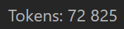

# TikToken Tokenizer Plugin

This plugin for [Obsidian](https://obsidian.md) displays the token count for the currently active note in the status bar. It uses the [js-tiktoken](https://www.npmjs.com/package/js-tiktoken) library, JavaScript port of OpenAI's `tiktoken` with the `o200k_base` encoding shared by `gpt-4o` and the `gpt-5` family.



## How it works

When you open a note or edit its content, the plugin recalculates the number of tokens and updates the status bar. A 150 ms debounce keeps Obsidian responsive while you type. Tokenization runs entirely in JavaScript with no WebAssembly or network calls, so it works on both desktop and mobile.

## Tokenizer modes

The plugin ships two modes, selectable in `Settings` → `Community plugins` → `TikToken Tokenizer`:

- **GPT-4o / GPT-5 (exact)** — default. Uses the `o200k_base` encoding shared by `gpt-4o` and the `gpt-5` family. This is the actual tokenizer OpenAI uses, so the count is exact.
- **Claude (approximate)** — see below for methodology.

### About the "Claude (approximate)" mode

Anthropic does not publish an offline tokenizer for Claude 3 or later — the only exact way to count Claude tokens is the [`/v1/messages/count_tokens`](https://platform.claude.com/docs/en/build-with-claude/token-counting) API, which requires an API key and a network round-trip per call. This plugin keeps everything local, so for Claude it offers an approximation rather than an exact count.

**Methodology.** Before Claude 3, Anthropic used a custom BPE tokenizer with vocabulary on the order of 100K. Of publicly available encodings, OpenAI's [`cl100k_base`](https://github.com/openai/tiktoken) (GPT-3.5 / GPT-4 family) is the closest analogue. On top of the raw `cl100k_base` count this mode applies a fixed **+15% safety margin** (`Math.ceil(count × 1.15)`), so the displayed number is intentionally a slight over-estimate — better to be pleasantly surprised than to blow past your context window.

Use it for budgeting your context window. If Anthropic publishes an official offline tokenizer for Claude 3+, this mode will switch to the exact implementation.

## Installation

### From the Community Plugin list

1. Open Obsidian and go to `Settings` → `Community plugins`.
2. Click `Browse` and search for "TikToken Tokenizer".
3. Click `Install`, then `Enable`.

### Manual Installation

1. Download `main.js` and `manifest.json` from the [latest release](https://github.com/S3ga1ov/tiktoken-tokenizer/releases).
2. Create a new folder in your vault's plugins directory: `YourVault/.obsidian/plugins/tiktoken-tokenizer`.
3. Copy both files into the new folder.
4. Reload Obsidian.
5. Go to `Settings` → `Community plugins`, find "TikToken Tokenizer", and enable it.

## For Developers

### Building the plugin

1. Clone the repository:
    ```bash
    git clone https://github.com/S3ga1ov/tiktoken-tokenizer.git
    ```
2. Navigate to the repository folder:
    ```bash
    cd tiktoken-tokenizer
    ```
3. Install the dependencies:
    ```bash
    npm install
    ```
4. Run the build script:
    ```bash
    npm run build
    ```

This produces `main.js` in the project root.

## License

This plugin is licensed under the MIT License.
